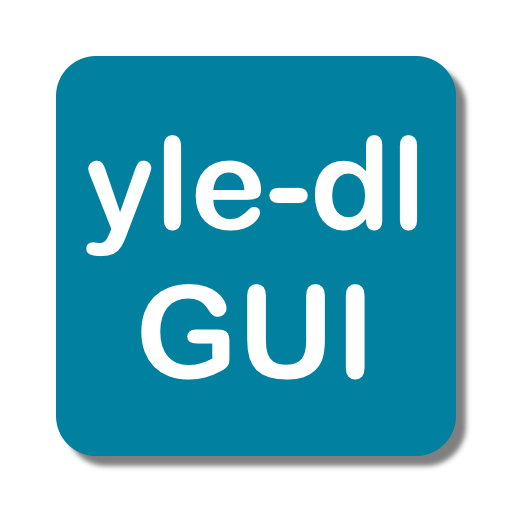
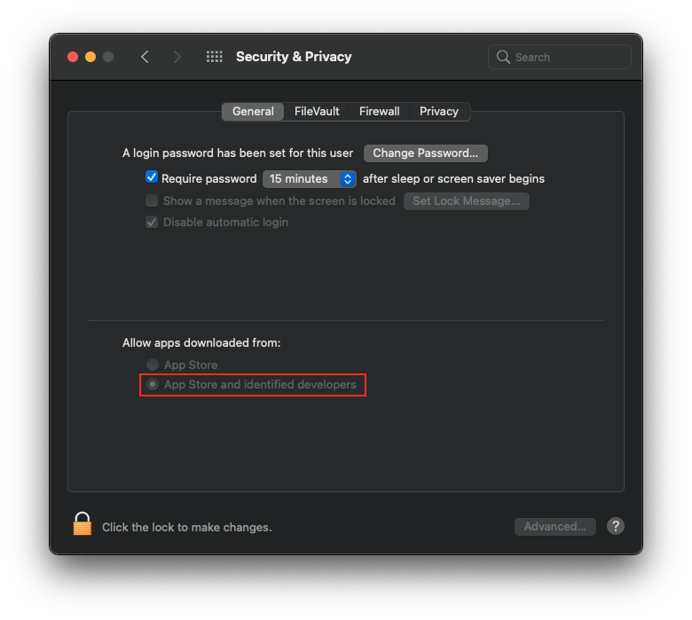
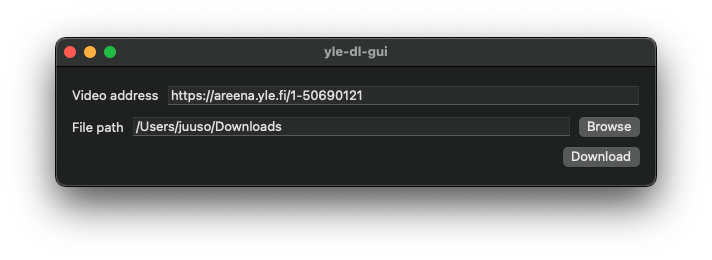
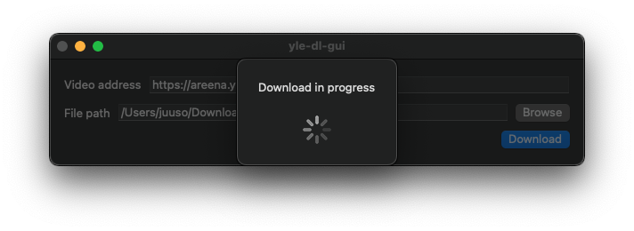
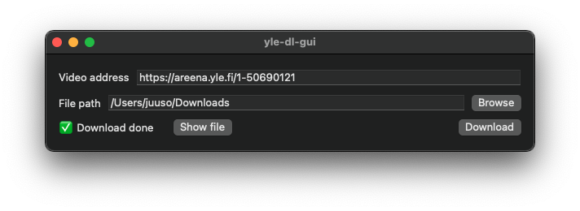

# Overview
yle-dl-gui is a macOS GUI for [yle-dl](https://github.com/aajanki/yle-dl) similar to [Areena-lataaja](https://simopot.github.io/areena/). yle-dl-gui does not include [yle-dl](https://github.com/aajanki/yle-dl), but instead uses the user installed version of it. yle-dl-gui is not signed, so allowed apps need to be set to **App Store and identified developers**.

# Screenshots

# How to Install yle-dl
1. Install [Homebrew](https://brew.sh)

In `Terminal.app` run:

2. `brew install python`
3. `brew install wget`
4. `brew install ffmpeg`
5. `brew install yle-dl`
