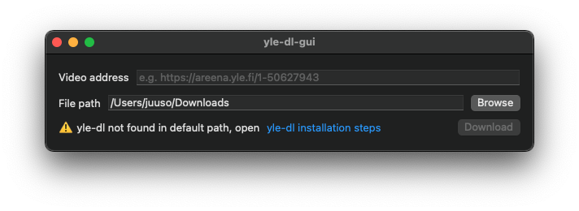

# Overview

[Download](https://github.com/jiinurppa/yle-dl-gui/releases)

**yle-dl-gui** is a macOS graphical user interface for [yle-dl](https://github.com/aajanki/yle-dl) similar to [Areena-lataaja](https://simopot.github.io/areena/). **yle-dl-gui** does not include [yle-dl](https://github.com/aajanki/yle-dl), but instead uses the user installed version of it. **yle-dl-gui** is not signed, so allowed apps need to be set to *App Store and identified developers*.

**yle-dl-gui** will check if [yle-dl](https://github.com/aajanki/yle-dl) exists at `/opt/homebrew/bin/yle-dl` ([new default path](https://docs.brew.sh/FAQ#why-should-i-install-homebrew-in-the-default-location)) and shows a warning if it doesn't. Downloading is still enabled. This warning can be ignored on Intel macs.

# Screenshots

# How to Install yle-dl
1. Install [Homebrew](https://brew.sh)

In `Terminal.app` run:

2. `brew install python`
3. `brew install wget`
4. `brew install ffmpeg`
5. `brew install yle-dl`
